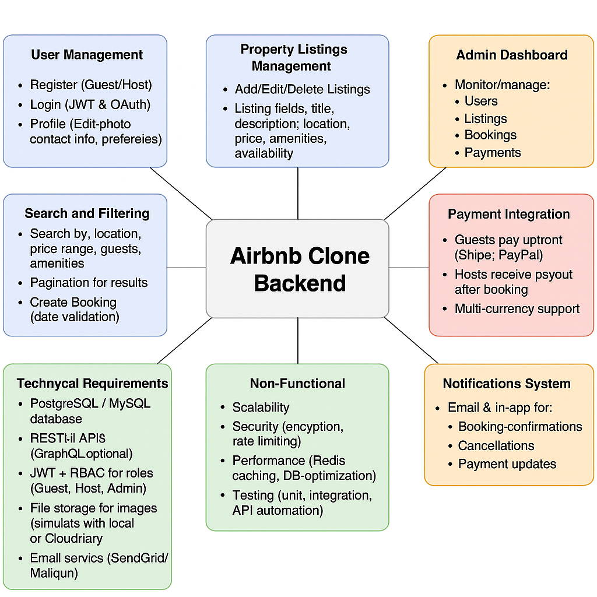

# Airbnb Clone – Backend Features and Functionalities

## 📁 Directory: features-and-functionalities/

This directory contains a visual and descriptive overview of all the core features and functionalities supported by the backend of the Airbnb Clone project.

---

## 🎯 Objective

To define and visualize the functional scope of the Airbnb backend system using a clear, organized feature map diagram created with Draw.io.

---

## 🔧 Key Features and Functionalities

### 👥 User Management
- Register as Guest or Host
- Secure Login & Logout
- Password encryption & recovery
- Role-based access control (Guest, Host, Admin)
- Update user profile

---

### 🏠 Property Management (Host-only)
- Create a new property listing
- Update listing details (description, price, location)
- Delete property listing
- View all listings by host

---

### 📅 Booking System
#### Guest Actions:
- Search for properties by location, date, and price
- View property details and availability
- Book a selected property
- View/cancel upcoming or past bookings

#### Host Actions:
- View booking requests
- Accept or reject bookings
- View booking calendar

---

### 💳 Payment Processing
- Initiate payment after successful booking
- Payment gateways supported: Credit Card, PayPal, Stripe
- Link payment to booking record
- View payment history

---

### ✍️ Review System
- Guests can leave reviews after their stay
- Ratings (1–5 stars) and written comments
- Hosts can view reviews on their properties

---

### 💬 Messaging System
- Guest ↔ Host direct messaging
- View message history
- Message timestamps

---

## 📊 Feature Diagram

The following diagram visually summarizes all key backend features:

> Diagram created using [Draw.io](https://draw.io)

---

## ✅ Status

- [x] Functional areas defined
- [x] Diagram created in Draw.io
- [x] Diagram exported as PNG
- [x] Documentation complete

---

## 📂 File List

