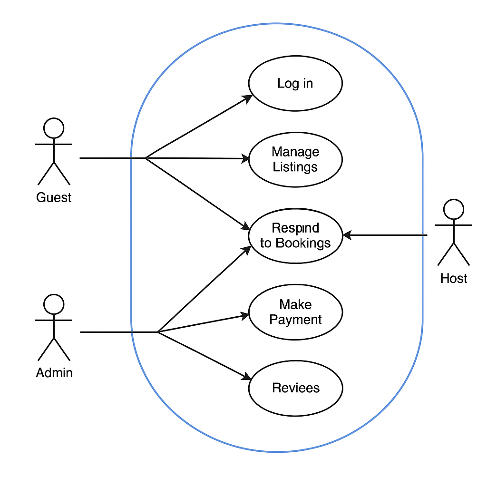

# Airbnb Clone – Use Case Diagram

## 📁 Directory: use-case-diagram/

This directory contains the use case diagram for the backend of the Airbnb Clone project. The diagram visualizes how different types of users interact with the core features of the system.

---

## 🎯 Objective

To represent the key interactions between system actors and the system functionalities using a use case diagram. This helps clarify what features the backend must support and who uses them.

---

## 👤 Actors

- **Guest**
  - Can register, log in, search properties, book stays, make payments, and leave reviews.
  
- **Host**
  - Can register, log in, list and manage properties, respond to booking requests, and view reviews.
  
- **Admin**
  - Can manage users, oversee platform activity, and ensure system integrity (optional feature extension).

---

## 🔧 Key Use Cases

- **User Authentication**
  - Log in, Register, Log out

- **Property Management**
  - Create listing, Update listing, Delete listing (host)

- **Booking System**
  - Search properties, Book property, Cancel booking, View bookings

- **Payment System**
  - Make payments, View payment history

- **Review System**
  - Leave reviews, Read reviews

- **Messaging (Optional)**
  - Host ↔ Guest communication

---

## 📊 Diagram Preview

---

## ✅ Status

- [x] Diagram created using Draw.io
- [x] Exported as PNG
- [x] Stored in `use-case-diagram/`
